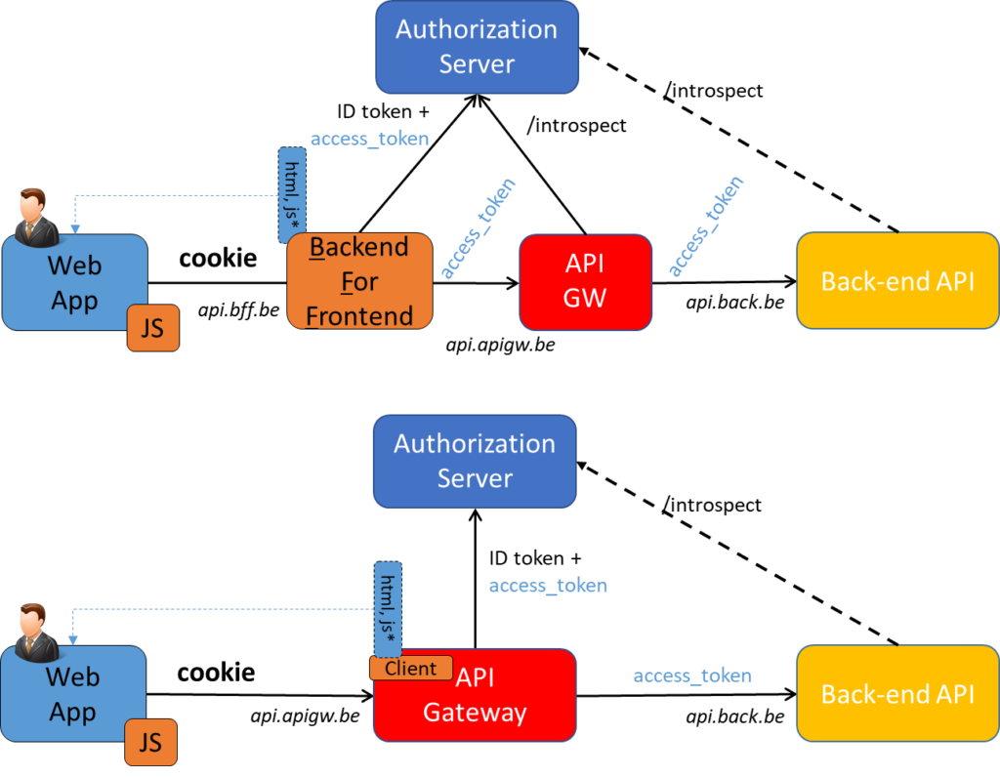
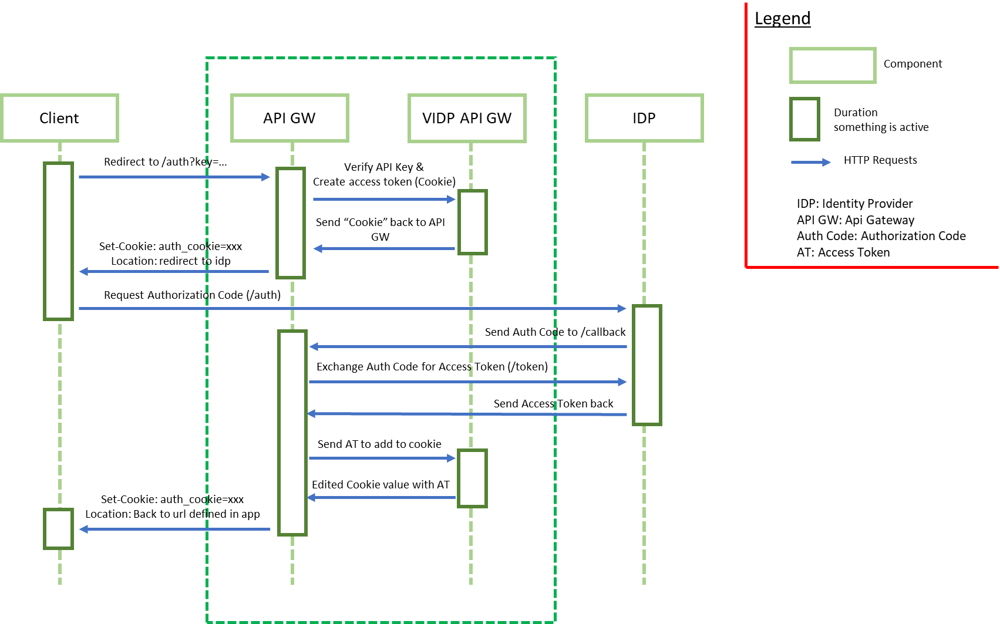
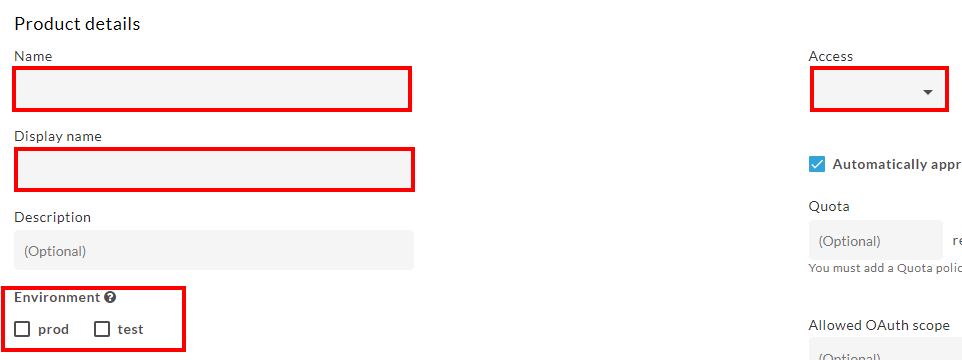
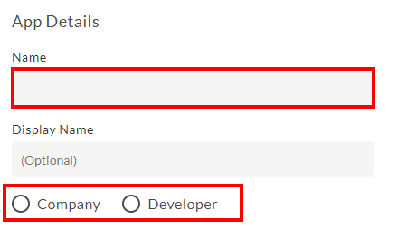
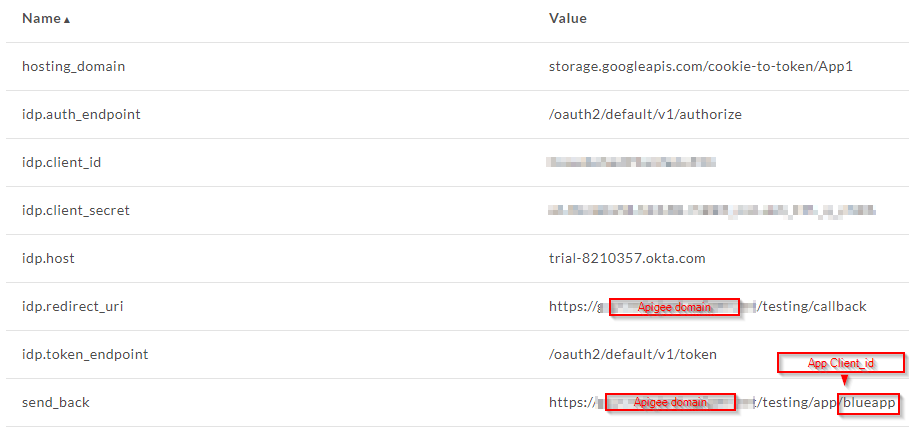

# Cookie to Access Token

## What is this project about?

The main goal of this project is to build a prototype framework on the Apigee Gateway that converts a cookie into an access token and also manages it without a Backend For Frontend. In modern web applications, clients can directly invoke APIs, interact with the authorization server and manage access tokens themselves. 

However, there are strong opinions (<i>based on a statement of the book “API Security in Action (2020)”, Neil Madden</i>) that web applications should continue to use cookies and that only a server should interact with the authorization server, these opinions exist because a simple web client cannot keep secrets and therefore is not as safe to interact with the as authorization server.

Nowadays, if you want to use this method to secure APIs, you need something that can convert the cookie received from the client into an access token so that the server component (in this case the API) can understand it. For this, a Backend For Frontend is used, the BFF interacts with the authorization server and so on.

## Why remove the Backend For Frontend?

By doing research about this topic we couldn’t really find a lot of pro’s and con’s about why you should use a Backend For Frontend or why you shouldn’t, this is why we formulated our own opinion about removing the BFF from the API Security when using an API Gateway.

We think that using a Backend For Frontend is not really necessary for converting the cookie to an access token, as we can achieve the same thing by using the Apigee Gateway. An API management tool like Apigee can manage our “cookies” and the access tokens or ID tokens received from the external Identity Provider.

### OAuth2 Sequence with cookie creation

## Available Features

* Cross Site Request Forgery protection
* Dynamic IDP settings (via app attributes on Apigee)
* Multiple IDP support (tested with Okta & Auth0)
* OpenID support
* Works with different JavaScript Frontend Frameworks (ReactJS, VueJs, ...)
* Supports the use of refresh tokens

### Future implementation possibilities:

* PKCE (Proof Key for Code Exchange)
* Automated Testing
* Verify ID tokens against JWKS
* Verify Scopes & audiences

## How to setup this project?

<ol>
  <li>Download the repository</li>
  <li>Navigate to the <b>proxy-bundle</b> folder</li>
  <li>Zip the <b>apiproxy</b> folder</li>
  <li>Create a proxy with this <b>apiproxy.zip</b>
    <ol>
      <li>Go to Apigee</li>
      <li>Click on API Proxies</li>
      <li>Click on the top right button <b>+Proxy</b></li>
      <li>Click on "<b>Upload proxy bundle</b>"</li>
      <li>Select the zip folder and give the proxy a name</li>
      <li>Click on <b>Next</b> & <b>Create</b></li>
      <li>Deploy your proxy to the test or production environment</li>
    </ol>
  </li>
  <li>Create an API Product
    <ol>
        <li>Go to Home page of Apigee</li>
        <li>Click on API Products</li>
        <li>Click on the top right button <b>+API Product</b></li>
        <li>Fill in the necessary fields</li>
        
        <li>Under "<b>API resources</b>" click on "<b>Add a proxy</b>" and select your previous created proxy</li>
        <li>Click in the top right on <b>Save</b></li>
    </ol>
  </li>
  <li>Create an Application
    <ol>
        <li>On the left navigation click on "<b>Publish -> Apps</b>"</li>
        <li>Click on the top right button <b>+App</b></li>
        <li>Fill in the necessary fields here aswell</li>
        
        <li>Under "<b>credentials</b>" click on the <b>Add product</b> and select your API Product</li>
        <li>In the section "<b>Custom Attributes</b>" add the following attributes
            <ul>
                <li><b>hosting_domain</b> - <i>(hostname of where the .css, .js, .png,... files are located on cloud storage)</i></li>
                <li><b>idp.auth_endpoint</b> - <i>(endpoint of the external identity provider to start the OAuth2 flow, mostly .../auth or /authorize)</i></li>
                <li><b>idp.client_id</b> - <i>(client_id of the application registered at the external identity provider)</i></li>
                <li><b>idp.client_secret</b> - <i>(client_secret of the application registered at the external identity provider)</i></li>
                <li><b>idp.host</b> - <i>(hostname of the external identity provider)</i></li>
                <li><b>idp.redirect_uri</b> - <i>(callback_uri, some endpoint within your Apigee proxy)</i></li>
                <li><b>idp.token_endpoint</b> - <i>(endpoint of the external identity provider to exchange the authorization code to an access token)</i></li>
            </ul>
        </li>
        <li>Click on the top right button <b>Create</b></li>
        <li>After you created the application, click in the top right on edit and add the last custom attribute to the application
          <ul>
            <li><b>send_back</b> - <i>(URL where Apigee needs to redirect the client to after successful authentication, it should end with ../app/your_app_key)</i></li>
          </ul>
        </li>
        <li>Click on the top right button <b>Save</b></li>
        
    </ol>
  </li>
  <li>Use the test web client application (1st Party)
    <ol>
        <li>Navigate to the <b>test-web-application</b> folder and install the necessary packages (command line: npm install)</li>
        <li>Check if the endpoints inside the <b>./src/App.js</b> are correct: inside the auth() function <b>/testing/auth</b> & in the getUserInfo() function <b>/testing/userinfo</b> if not, change them to the endpoint you are using inside the Apigee Proxy</li>
        <li>Build the project via the command line: <b>npm run build</b></li>
        <li>Navigate to the <b>build</b> folder and copy these files and folders to your cloud storage (e.g Google Cloud Storage)</li>
        <li>You can now start the application via https://yourdomain.com/testing/app/your_apigee_app_key</li>
    </ol>
  </li>
</ol>
